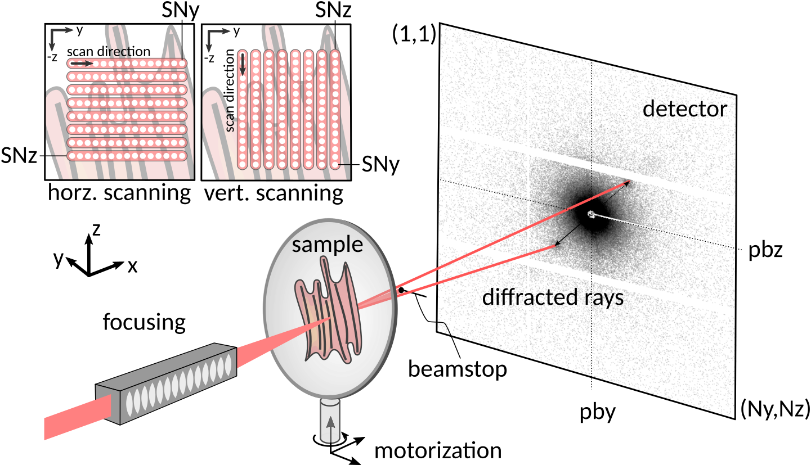

.. _geometry:

########
Geometry
########

We follow the convention that x is along the direction of the X-ray beam. All other directions then follow as a consequence. See the figure below for a sketch of a standard scattering geometry. The ``detDistance`` used in the toolbox is the distance to the primary beam position, not the distance to the point of normal incidence.

   Sketch of the scanning X-ray diffraction or scattering geometry. Shorthand labels for the primary beam position (pby/pbz) and scanning dimensions (SNy/SNz) are indicated. Note that the x-direction is along the X-ray beam (hence, the x). 
